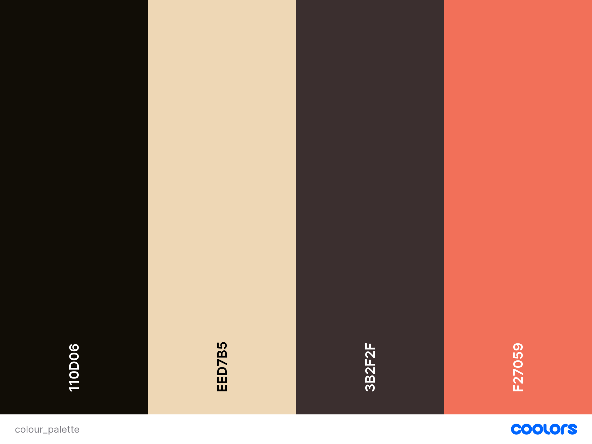
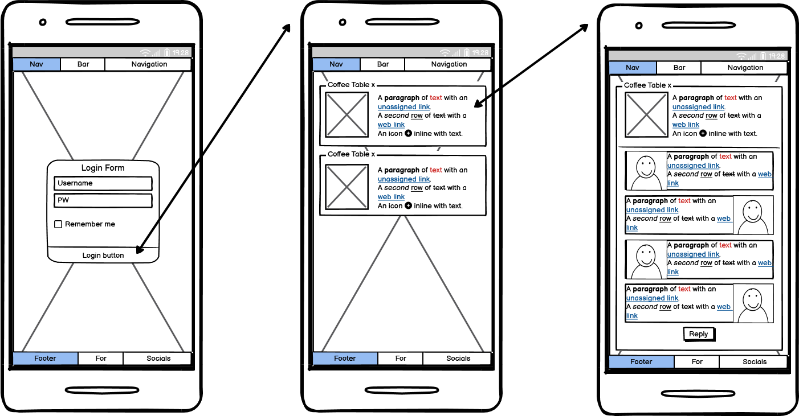
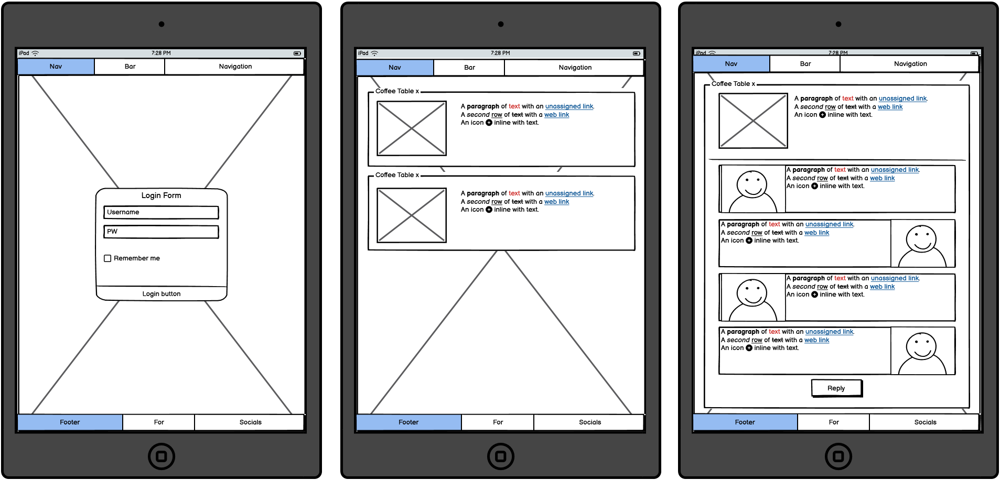
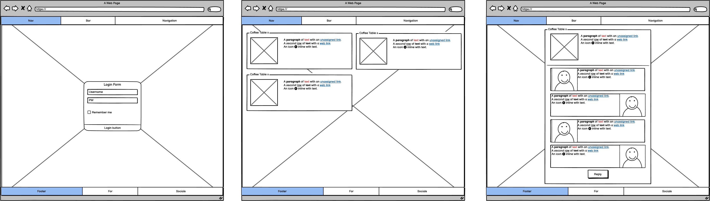

# CoffeeHouse

[Deployed site](http://coffee-house-4393250a7201.herokuapp.com/)\
Use "Ctrl + click" or "CMD + click" to open in new tab

# Table of contents    

1. [UX](#ux)
2. [Features](#features)
    1. [Existing Features](#existing-features)
    2. [Future Features Consideration](#future-features-consideration)
3. [Technologies used](#technologies-used)
4. [Testing](#testing)
5. [Deployment](#deployment)
6. [Credits](#credits)
7. [Acknowledgements](#acknowledgements)

# UX

### User stories
* First Time Visitor Goals
    * First time users should be able to understand the purpose of the site.
    * They should be able to navigate the site without any issue.
    * The site should encourage users to interact with it.

* Returning Visitor Goals
    * Returning visitors should be able to notice any changes on the website.
    * The site should still encourage users to interact with it.

* Frequent User Goals
    * Frequent users should be able to take a break and have enjoyable conversation with the community.
    * They may spend some time looking at other users’ tables.

### Design

Colour Scheme

Main colours used on the website\

Typography

* Segoe Print is used with a fallback to Calibri first and then to sans-serif.

### Wireframes

Mobile

Tablet

Desktop

# Features

## Existing features

### Landing page 

The landing page itself is the login page. It is meant to encourage visitors to create an account before proceeding to the site.\
Once logged in, users will be presented with the currently active tables.\
Due to Django Allauth’s session handling, in case a user doesn't log out before leaving the site, the session will not be terminated
and they will be presented with the tables as well instead of a login page again.\

[Tables](static/assets/images/tables_image.PNG)

\
Here users can create or join any table they wish.\
To create a table they simply need to locate the creation button, and a modal will be presented to name and describe the table.\

[Table creation](static/assets/images/table_creation_image.PNG)

\
While it is possible to visit this page without logging in, the creation button is hidden, until the user is logged in.\
This is to ensure only verified users can create new tables.\
Table join buttons remain visible, instead they redirect to the login page thanks to Django Allauth's login required view property.\
In this case after a successful login, the user will be redirected to the table view right after.

### Table

Each active table will have a separate page. On this page users can have a conversation with each other.\
Users can add replies using the button on the bottom. They can also update their comments easily.\
Tables can be deactivated only by the user who created them, and the corresponding button is visible exclusively to the creator.

[Conversation](static/assets/images/conversation_image.PNG)

### Navigation bars

The footer element is positioned and fixed at the bottom of the page.\
The element provides links to social media platforms, namely in order Facebook, X, Google and Github.\

On top is the navigation bar. It is positioned and fixed to the top of the screen.\
Once a user is logged in, the bar will be populated with a dropdown menu, greeting the user.\
In this menu the user can logout and access their information to update.\
If the site is currently displaying a table page, a back button is added so the users can easily navigate back to all tables.

### Account management

On this page users can update their details, initiate password reset, or delete their account.\
Users can upload their own images as well. This field is optional. If the user has not uploaded an image, they will be assigned  with one of the 5 default avatar images currently available.

[Account management](static/assets/images/account_management_image.PNG)

### Django Allauth's core features

The project is integrated with Django Allauth’s core features. This enables easy user management and provides essential security protections.\
It is used for user creation, user login, user logout, and password management.\
This ensures users have accurate details and enforces strong password usage.

### Google SMTP service

A dedicated Google account was created and modified to be the messaging client for the project.\
This email service was then integrated to support Django Allauth features.\
Currently the password reset workflow uses this service.

[Password reset email](static/assets/images/password_reset_email.PNG)

### Cloudinary

This 3rd party media storage service is used to store user-uploaded images.

[Cloudinary image](static/assets/images/cloudinary_image.PNG)

## Future features consideration

* Verified account creation
    Utilizing Django Allauth's core features further with the SMTP worker, email addresses can be verified.
* User feedback can be given after the user updated their details.
* User deletion can be made safer with prompting the user to verify their password.
* Table images can be user uploaded images.
* Users can upload images to comments.
* A personalised view, where users can easily see which table they have joined.
* Friend feature can be added for private messaging for users.

# Technologies used

* The core project is written in HTML5, CSS3 and Python.
* Used [Balsamiq](https://balsamiq.com) to create wireframes.
* Used [Visual Studio Code](https://code.visualstudio.com) as IDE.
* Used [Github](https://github.com) to store and deploy the repository.
* Used [Sourcetree](https://www.sourcetreeapp.com) for version control.
* Used [Opera](https://www.opera.com), [Mozilla](https://www.mozilla.org/en-GB/) and [Chrome](https://www.google.com/intl/en_uk/chrome/) browsers and their respective developer tools for testing.
* Used [ChatGPT](https://chatgpt.com) for debugging, code and content generation.
* Used [W3Schools](https://www.w3schools.com) to help to understand and write codes.
* Frequently visited [Stack Overflow](https://stackoverflow.com/questions) to understand some behaviours.
* Used [Bootstrap](https://getbootstrap.com) as css.
* Used [Font Awesome](https://fontawesome.com) to display footer elements.
* Used [Freepik](https://www.freepik.com) to acquire free images.
* Used [Krita](https://krita.org/en/) and [Canva](https://www.canva.com) for modifying pictures.
* Used [Coolors](https://coolors.co) to create color palette.
* Used [Microsoft Windows](https://www.microsoft.com/en-gb/windows?r=1) in-built **Snippet** tool to capture images.
* Used [Cloudinary](https://cloudinary.com) to store media images.
* Used [PostgreSQL](https://www.postgresql.org) as database.
* Used [Heroku](https://www.heroku.com) as hosting platform.
* Used [Google](https://www.google.com) as SMTP service provider.
* Used [Pycodestyle](https://pycodestyle.pycqa.org/en/latest/) to validate python files.
* Used [Black](https://black.readthedocs.io/en/stable/?utm_source=chatgpt.com) linter to beautify python codes.
* Used [pydotplus](https://pydotplus.readthedocs.io) to generate database diagrams.
* Used [Wordmark](https://wordmark.it) to select fonts.

# Testing

Testing is extracted to it's own document, [TESTING](https://github.com/bics/CoffeeHouse/blob/main/TESTING.md)

# Deployment

### Heroku
The project is deployed to [Heroku](https://www.heroku.com). In order to achieve this the following steps were taken:\
1. Sign into [Heroku](https://www.heroku.com).
2. Start creating a new app.
3. Use Github as preferred deployment method. 
4. Connect to your Github account, and connect the corresponding repository.
5. Setup the reqiured environment variables.
    * DATABASE_URL
    * env_email_host
    * env_email_password
    * env_email_default
    * CLOUDINARY_URL
    * SECRET_KEY_env
6. Once it successfully connected select a branch to deploy and hit "Deploy branch".

### Forking a repository

1. Sign into [Github](https://github.com/) (can be done later).
2. On [Github](https://github.com/) locate the [Coffeehouse](https://github.com/bics/CoffeeHouse) repository.
3. On the top right hand side click on the "Fork" option.
4. Sign into [Github](https://github.com/) (not needed if step 1. was taken).
5. The repository should be present under your account's repositories.

### Download local repository

1. Navigate to the [Coffeehouse](https://github.com/bics/CoffeeHouse) repository.
2. On the right side select the "Code" dropdown menu.
3. Download the repository as a .zip file.
4. Extract the downloaded file.
5. Open up your preferred IDE and add the extracted folder as a project.

### Clone a repository with Sourcetree

1. Import SSH key. If SSH key already imported skip these steps
    1. Acquire the SSH key, and password for this repository.
    2. Locate the "Tools" menu, and select the "Create or import SSH keys" option.
    3. In the dialog select "Load" and locate the acquired SSH key.
    4. If prompted sign in to [Github](https://github.com/) account and enter the password.
2. Click on the "+" icon to add a local repository.
3. Select the "Remote" option on the top navigation bar.
4. Search for the [Coffeehouse](https://github.com/bics/CoffeeHouse) repository and hit clone.

# Credits
    * Gitignore generated via [ChatGPT](https://chatgpt.com)
    * Index.html template was copied and modified from previous [Best Barber project](https://github.com/bics/BestBarber)
    * Used [Bootstrap](https://getbootstrap.com) as css.

### Code

    * Modal code block taken and modified from official Bootsrap documentation https://getbootstrap.com/docs/5.0/components/modal/
    * Card code block taken from official Bootstrap documentation for cards https://getbootstrap.com/docs/5.3/components/card/
    * Dropdown menu code block taken from official Bootstrap documentation for dropdowns https://getbootstrap.com/docs/4.0/components/dropdowns/
    * Allauth fields taken from Code Institute material
    * Snippets generated using Chatgpt:
        * tables.html image selector for new table creation
        * Styling for the above image selector
        * Hiding form field when creating new tables
        * Auto updating form with logged in user
        * Conversation view
        * Custom admin user register for site
        * Error handling for replies, when users have no pictures
        * Allauth settings
        * Allauth signup form
        * Allauth login form
        * Account management form fields
        * Null check for model variable
        * Deletion view try-catch block
        * SMTP settings entries
        * Cloudinary settings for file uploads
        * Helper text for avatar uploads
        * Remove aria-describedby for account update form
    * Code inspired from playlist created by Codemy.com https://www.youtube.com/watch?v=HHx3tTQWUx0&list=PLCC34OHNcOtqW9BJmgQPPzUpJ8hl49AGy
        * 

### Content

### Media

* coffee_grounds by [stockking](https://www.freepik.com/free-photo/close-up-view-dark-fresh-roasted-coffee-beans-coffee-beans-background_10427093.htm#fromView=search&page=1&position=39&uuid=dd3094e1-c073-4c34-a288-5332a4380af5&query=coffee)

* offee_mug_cartoony by [catalyststuff](https://www.freepik.com/free-vector/coffee-love-foam-with-beans-cartoon-icon-illustration_12006499.htm#fromView=search&page=1&position=48&uuid=dd3094e1-c073-4c34-a288-5332a4380af5&query=coffee)

* coffee_drank by [wirestock](https://www.freepik.com/free-photo/overhead-vertical-shot-person-s-hand-near-latte-art-coffee-wooden-surface_7901191.htm#fromView=search&page=2&position=2&uuid=dd3094e1-c073-4c34-a288-5332a4380af5&query=coffee)

* coffee_interior  by [ChatGPT](https://chatgpt.com)

* coffee_mug_tilted by [catalyststuff](https://www.freepik.com/free-vector/coffee-cup-cartoon-vector-icon-illustration-food-drink-icon-isolated-flat-vector_394067450.htm#fromView=search&page=4&position=29&uuid=dd3094e1-c073-4c34-a288-5332a4380af5&query=coffee)

* coffee_separated by [8photo](https://www.freepik.com/free-photo/coffee-beans-top-view-white-background-space-text_8060692.htm#fromView=search&page=2&position=39&uuid=c749efba-f08b-4b9c-ad49-001cd20ad639&query=coffee)

* coffee_separated_nobg modified in [Canva](https://www.canva.com)

* avatars.jpg by [pikisuperstar](https://www.freepik.com/free-vector/profile-icons-pack-hand-drawn-style_18156023.htm#fromView=search&page=1&position=7&uuid=80e53d81-6ddc-4bcb-9e26-615757ec447a&query=avatar)

* empty_avatar by [juicy_fish](https://www.freepik.com/free-vector/blank-user-circles_134996379.htm#fromView=search&page=1&position=1&uuid=f8d57935-e0cc-4c71-9735-a9e8336ee67e&query=empty+avatar)

* favicon by [catalyststuff](https://www.freepik.com/free-vector/cute-sleepy-mug-with-coffee-cartoon-icon-illustration_12158347.htm#fromView=search&page=1&position=13&uuid=55fd4fe4-90b3-4675-bd30-bde1c81a4b13&query=coffe+mug) modified with ChatGPT

# Acknowledgements

